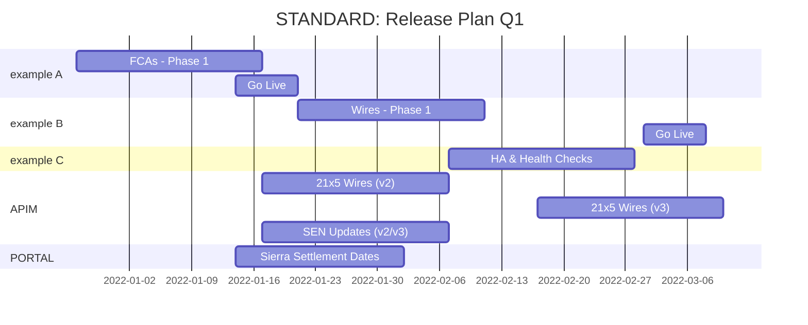

**<h1> STANDARD: RELEASE PLAN TEMPLATE </h1>**

## <u> **OVERVIEW** </u>
Below you will find supporting references, project timelines, and formal descriptions for all current projects and work items included in the STANDARD: Q1 Release Plan.

## <u> **POINTS OF CONTACT** </u>
Please contact the associated personnel for general information or support.

:taco: **QA Engineering:** kit@made.llc 

## <u> **TIMELINE** </u>
 **Q1.2022 [JAN - MAR]** 

## <u> **BREAKDOWN** </u>

### JANUARY
- **COMPLETE** - API v3
   - Add GET loan balance and cash mgr
   - P006
- **COMPLETE** - Portal
   - P006
- **COMPLETE** - CDDC (v2 and v3)
   - edge case fix

### FEBRUARY
- **COMPLETE** - Portal nights/weekends Sierra settlement date fix (2/3/22)
- **COMPLETE** API v2 10.7.3 (2/8/22 target)
   - Euro vs USD SEN protection add 
   - API v2 SEN "locking" 
   - SEN logging
   - SEN locking and idempotency 
   - GET payment parsing edge case

### MARCH
- WLS (3/9/22)
   - Error handling improvement critical for ongoing BCP stance
   - .NET upgrade
   - Email notices upon error
- Portal P010 – mid March
- API v2 and API v3 21 x 5 wire update (3/31/22)

### APRIL
- API v3 BCP additions (mid April)