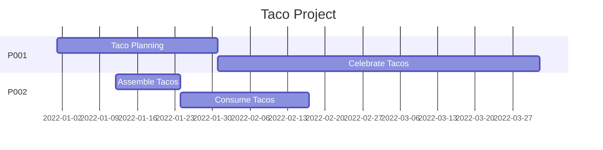
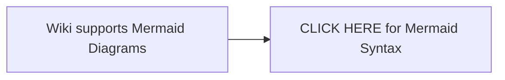
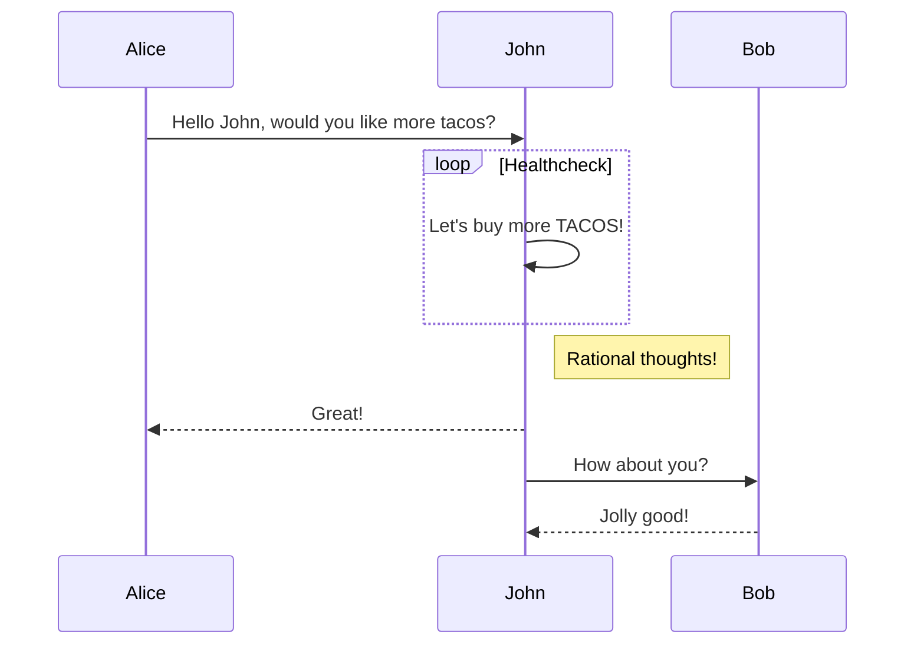
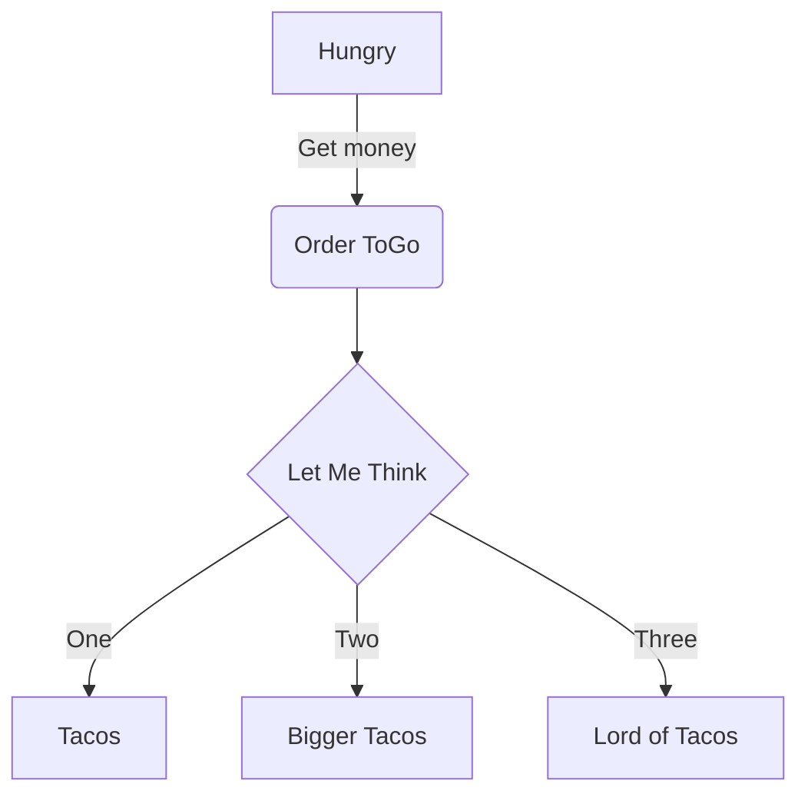

**<h1> STANDARD: MARKDOWN TEMPLATES </h1>**


Grab whatever you need for your own project documents. For more information on basic Markdown syntax guidance in Azure DevOps, view [Microsoft's Documentation](https://docs.microsoft.com/en-us/azure/devops/project/wiki/markdown-guidance?view=azure-devops)


## <span style="color:#555555"><u> **OVERVIEW** </u></span>
[enter project description here]


## <span style="color:#555555"><u> **POINTS OF CONTACT** </u></span>
[enter points of contact information here]

:taco: **QA Engineering:**<span style="color:gold"> kit@made.llc </span>


## <span style="color:#555555"><u> **TIMELINE** </u></span>
[enter project timeline information here]

<span style="color:#A6A6A6"> **TARGET DATES - Q1** </span>



## <span style="color:#555555"><u> **CORE SOLUTIONS** </u></span>
[enter core solutions used in the project here]

1. Hardware/Software 1
1. Hardware/Software 2
   - [sub-text here]
1. Hardware/Software 3
   - [sub text here]
      -  [sub-sub text here]


## <span style="color:#555555"><u> **PREREQUISITES** </u></span>
[enter all required and optional prerequisites here]

- [ ] Requirement A  (Optional) 
- [x] Requirement B  (Required)
- [x] Requirement C  (Required)


## <span style="color:#555555"><u> **PROJECT PLANNING** </u></span>
[enter/edit project planning query information here]
::: query-table abb5ade2-9daa-46f8-b7f7-b85e0b21505e
:::


## <span style="color:#555555"><u> **PROJECT BREAKDOWN** </u></span>
[enter relevant project information, process flows, and supporting diagrams here]

##### <span style="color:#A6A6A6"> **MATH** </span>
$$
\sum_{i=1}^{10} t_i
$$

$$
\int_0^\infty \mathrm{e}^{-x}\,\mathrm{d}x
$$ 

##### <span style="color:#A6A6A6"> **MERMAID DIAGRAM** </span>


##### <span style="color:#A6A6A6"> **SEQUENCE CHART** </span>


##### <span style="color:#A6A6A6"> **FLOW CHART** </span>



## <span style="color:#555555"><u> **CODE SAMPLES** </u></span>
[enter code breakdown and samples here]

##### <span style="color:#A6A6A6"> **C#** </span>
``` csharp
using Tacos;

namespace MyTaco
{
  class Taco
  {
    static void Main(string[] args)
    {
      string txt = "Hello Tacos";
      Console.WriteLine(txt.ToUpper());   // Outputs "HELLO TACOS"
    }
  }
}
```

##### <span style="color:#A6A6A6"> **SQL** </span>
``` sql
-- Taco Selector
WITH cte_Tacos (TacoType) AS (
    SELECT 'Beef Taco' UNION
    SELECT 'Chicken Taco' UNION
    SELECT 'Pork Taco' )
SELECT TOP 1 TacoType FROM cte_Tacos ORDER BY NEWID()
```


## <span style="color:#555555"><u> **REFERENCES** </u></span>
[enter references, resources, and helpful links here]

- URL 1 - [text to display](http://www.tacoipsum.com/)
- URL 2 - [text to display](https://www.made.llc/)