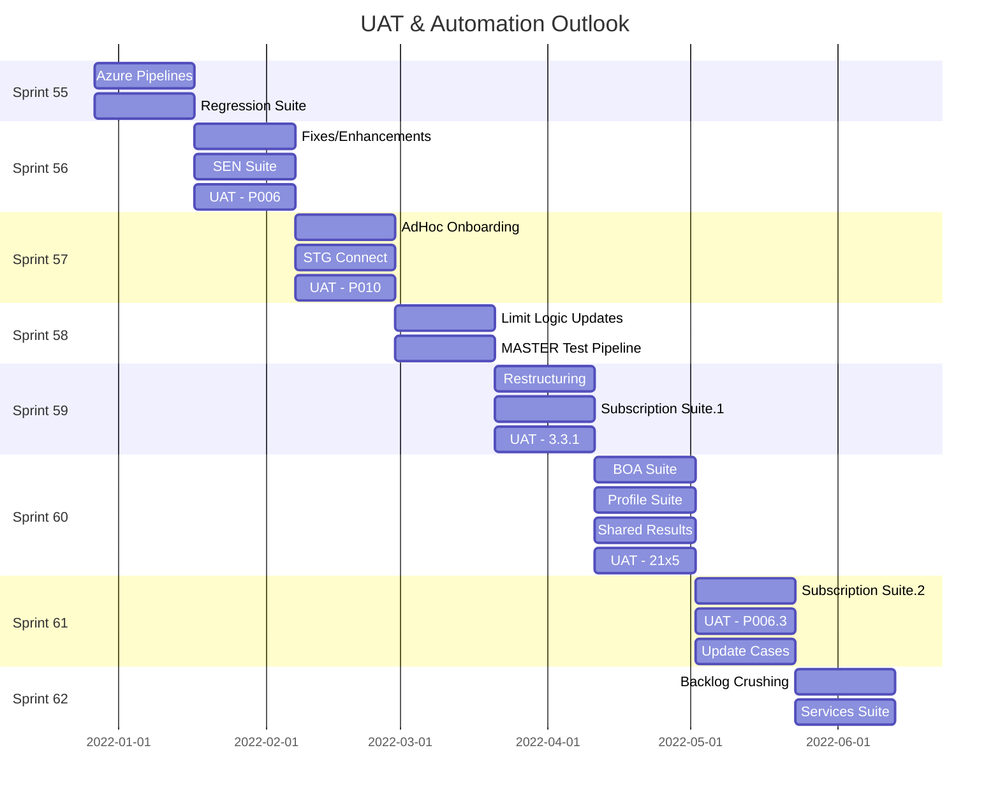

**<h1> STANDARD: TEST STRATEDGY AND PLANNING TEMPLATE </h1>**

## <u> **OVERVIEW** </u>
The **Test Strategy & Planning** efforts defined by QA Engineering in collaboration with internal stakeholders, will encompass the various testing methods for validating critical business systems and project development work within the STANDARD:DevOps group. Tests are defined and prioritize by the project group and executed in accordance with the specified test methods and project timelines.

## <u> **POINTS OF CONTACT** </u>
For all testing and automation related inquires or issues, please contact the associated personnel for general information or support.

:taco: **QA Engineering:** kit@made.llc 

## <u> **PROJECTS** </u>
The primary focus of the initial STANDARD testing efforts will be on the customer facing Portal and Back Office interfaces as well as the various APIs utilized by customers to facilitate frictionless transactions across STANDARD's suite of banking solutions: 

- STANDARD: Exchange
- FX Quoting
- FX Trade Execution 
- Foreign Currency Payments
- Internal Transfers
- Profile Connections

## <u> **METHODS** </u>

### AUTOMATED TESTING
See [STANDARD: Automation](../README.md) for more info. 

#### **Backlog** 
- [BACKLOG SUITE]() - this is a query based test suite and will automatically pull in any Test Case tagged with **[@]_Automate** OR **[@]_Update**

Below is a 6 MONTH timeline of all completed, current, and future UAT and automation efforts conducted by the STANDARD project team.

#### **Timeline**

### LOAD TESTING
Load testing will test the performance of our API endpoints by using Apache JMeter & LoadRunner - testing solutions that enable STANDARD to make HTTP requests to a given endpoint and measure the response time, error rates, and other data from responses.

[LOADRUNNER REPO]()
[PERFORMANCE TEST REPO]()

### UAT TESTING
STANDARD personnel will validate each business process, sub process and related extensions defined in the Azure Test Plans (EX: [P010 UAT]()). As validation of each test case is completed, STANDARD will indicate acceptance or rejection for such process as listed in each test case’s expected results. For each business process that does not meet STANDARD’s functional requirements, stakeholder and project members will mutually agree upon the appropriate resolution. The STANDARD validation effort will include the following test phases and environments:
- DEV
   - Build/Release Testing (Automated)
   - API Testing (Manual/Automated)
   - Unit Testing (Automated)
- QA
   - API Testing (Manual/Automated)
   - Regression Testing (Manual/Automated)
   - Portal/BO Testing (Manual/Automated)
   - UAT w/BSA (Manual)
- STG
   - API Testing (Manual/Automated)
   - Regression Testing (Manual/Automated)
   - Portal/BO Testing (Manual/Automated)
   - UAT w/BSA + Stakeholders (Manual)
#### **Assumptions**
STANDARD project teams will lead and conduct its own UAT sessions, with business personnel playing a supporting role. QA/BSA members of the project team will provide custom business scenario test cases, supporting data, expected results and success criteria. In the event a subset of the deliverable extensions and core code solutions cannot be fully tested and approved by stakeholders by end of the project timeline, STANDARD project managers will collaborate with affected parties on any necessary changes in priority, adjusting the release scope and timeline accordingly. 
#### **Issue Tracking**
Issues found as a result of project testing efforts and UAT will be tracked within the respective Test Plan and Test Suite created in Azure DevOps. If the result of a failed test is found to be valid issue (excluding false positives), a Bug will be created in Azure DevOps to be worked on by the STANDARD project development team. Daily UAT discussions will occur during the morning Stand-Up meeting at 11:00 AM PST. Additional discussions may occur in parking Lot sessions or appropriate Scrum ceremony and will be used to determine the priority and course of action need to resolve issues accordingly.   

The STANDARD project team backlog will track all application or technical issues that do not meet business requirements. An issue priority level will be used, along with severity to determine the urgency in fixing an issue. When assigning a severity or priority to an issue, the following scale will be used:
- **Severity Scale**
   - <u>Very High or High:</u> A major issue where a large piece of functionality or major system component is completely broken.  There is no workaround and testing must halt. 
   - <u>Medium:</u> A significant issue where a large piece of functionality or major system component is not working properly.  There is a workaround, however, and testing can proceed. 
   - <u>Low:</u> A minor issue that imposes some loss of functionality, but for which there is an acceptable and easily reproducible workaround.  Testing can proceed without interruption.
- **Priority Scale**
   - <u>Very High or High:</u> This has a major impact on STANDARD.  This must be fixed immediately!
   - <u>Medium:</u> This has a major impact on STANDARD.  The problem should be fixed before release of the current version in development, or a provisional update must be issued if possible.
   - <u>Low:</u> This has a minor impact on STANDARD.  The issue should be fixed if there is time, but it can be deferred until the next release.

#### **Risks**
Risks will be determined at the project planning phase and adjusted as necessary when deemed appropriate by the project team and stakeholders. During the risk assessment, if a potential risk is identified, a solution or plan of action should be developed in collaboration with stakeholders. This list should be reviewed throughout the life of the project, at points such as when the project plan is being revised for the next lifecycle stage, to reassess whether risk factors have changed as the project progresses. 

<u>Risk Assessment</u> - [CLICK HERE](../../wiki-risk-assesment.md)
- **Low** - Very unlikely that this will occur during the life of the project 
- **Medium** - There is a 50/50 chance that this will occur during the life of the project 
- **High** - Very likely that this will occur during the life of the project

#### **Scope**
Project scope will describe the work agreed to be delivered by the STANDARD project team - detailing the constraints or limitations of the project and associated timelines and risks.

<u>Statement of Work</u>
1. What the project is, why it’s happening, and what it will achieve (overview)
1. Who has approval (governance)
1. How the project will be completed (approach + phases + tasks)
1. What will be produced (deliverables)
1. When it will be delivered (timeline + milestones)
1. What it will cost (estimate + payment schedule)
1. What is and isn’t included (assumptions)

#### **Schedule**
Timelines, progress, and schedule of a project will be tracked in Azure DevOps at the EPIC level - which includes all PBIs, Bugs, and Tasks associated with project development and sign-off.

### **UNIT TESTING**
Unit testing is done at the development level automatically as code is committed. This is the initial testing phase where the smallest components or the modules of the software is tested individually. With this method of testing, developers can isolate each module, identify and fix the system defects at a very early stage of the software development lifecycle (SDLC). Primarily, a unit test verifies different behavioral aspects of the system under test and can be broadly classified into state-based and interaction-based unit testing. 

